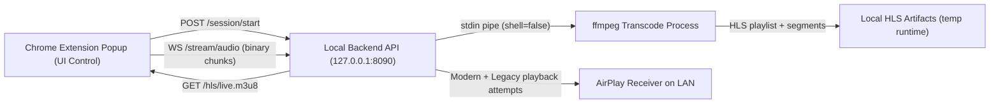

# Architecture and Security Notes

## Data Flow

## Trust Boundaries

- Trusted boundary: local extension process + loopback backend process.
- Untrusted boundary: receiver IP input and LAN device responses.
- Guardrails:
  - API is loopback-only.
  - Session-scoped token is required for stream ingress and stop.
  - Receiver addresses are restricted to private IPv4 ranges.
  - Runtime files are path-constrained to isolated temp folders.

## Failure Modes and Trade-offs

- Device protocol variance:
  - Modern and legacy initiation endpoints are attempted.
  - Failure is reported as best-effort (no guaranteed playback on every receiver).
- Extension popup lifecycle:
  - If popup closes, stream teardown is triggered.
  - This keeps security posture tighter but can reduce stream continuity.
- Local dependency:
  - ffmpeg is mandatory for transcoding/HLS.
  - Backend reports unavailability when ffmpeg is missing.
- Network policy:
  - Loopback-only control plane lowers exposure risk.
  - Multi-host orchestration is intentionally out of scope for this prototype.
